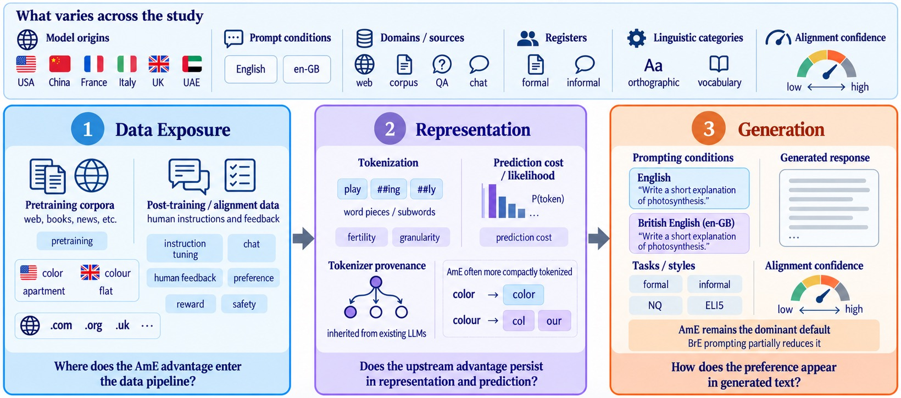

# LLM Structural Bias

Code for auditing American English (AmE) and British English (BrE) across three stages of the LLM pipeline: data exposure, representation, and generation.

Paper:

```text
How Does “English (US)” Become the Default? Triangulating Structural Bias Towards American English Across the LLM Pipeline
```

[Paper](https://arxiv.org/abs/2604.04204) · [Project website](https://tafseer-nayeem.github.io/LLM-structural-bias/)

<p align="center">
  <a href="assets/figure_1_pipeline.jpg"></a>
</p>

<p align="center"><em>Figure 1. The study traces the AmE default from training data through model representation to generated text. Select the figure for a larger view.</em></p>

<a href="https://huggingface.co/datasets/tafseer-nayeem/ame-bre-structural-bias"> AmE–BrE regional variant dataset</a> · 1,813 matched pairs used for the corpus and representation analyses.

- `data_audit/` audits regional variants in pretraining and post-training data and scores document-level regional alignment with DiAlign.
- `representation/tokenization/` measures tokenizer fertility and produces the token-length figures.
- `representation/contextual_asymmetry/` contains the sentence-level semantic-equivalence and prediction-cost experiments.
- `dialign/` provides the shared regional alignment scorer used for pretraining documents and generated text.
- `resources/` contains a tiny local example resource and a helper for downloading the full AmE--BrE variant resource from Hugging Face.

Each package has its own requirements and instructions. Commands in the documentation are written relative to the repository root.

## Full AmE--BrE resource

The full 1,813-pair AmE–BrE variant resource is available on [Hugging Face](https://huggingface.co/datasets/tafseer-nayeem/ame-bre-structural-bias). Download it into this repository with:

```bash
pip install datasets
python resources/fetch_ame_bre_resource.py \
  --repo-id tafseer-nayeem/ame-bre-structural-bias
```

This writes:

```text
resources/AmE_BrE_variations.json
```

Paper-scale scripts use that path by default. The local checks below use the small example resource and do not require network access.

## Quick checks

```bash
bash data_audit/scripts/run_offline_checks.sh
bash representation/tokenization/scripts/run_example_checks.sh
PYTHONPATH=dialign/src python -m unittest discover dialign/tests
```

The checks use local example data and do not download a corpus or model.

## Authentication

Some Hugging Face datasets and tokenizers require accepted access. Provide credentials through the environment rather than placing a token in the repository:

```bash
export HF_TOKEN="your_token"
```

For full representation reruns, gated Hugging Face model access may also be
configured with the CLI:

```bash
hf auth login
hf auth whoami
```
